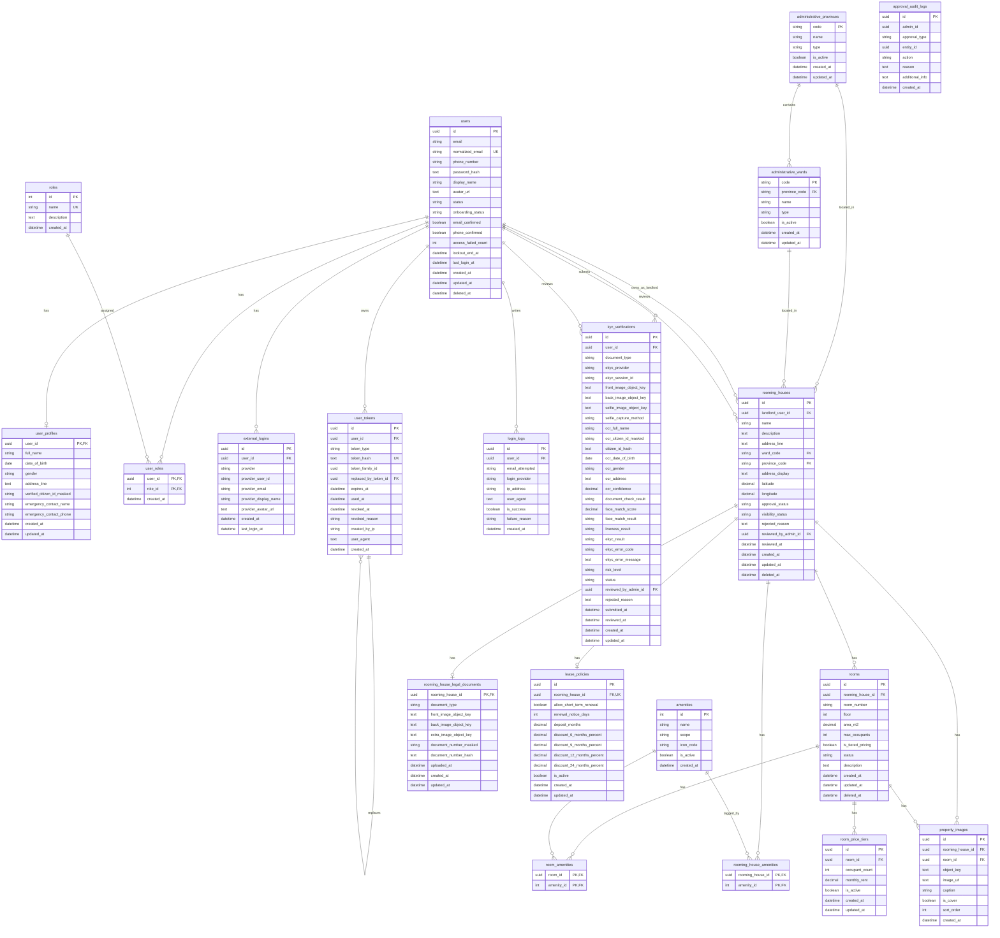

# Database ERD - Smart Rental Platform

Ngay tao: 2026-05-30  
Nguon ra soat: `AppDbContext`, Domain Entities va EF Core Configurations hien tai.

> Ghi chu: File nay mo ta schema dang duoc dang ky trong `AppDbContext`. Entity `AdministrativeDistrict` van ton tai trong Domain, nhung hien tai khong co `DbSet` va khong thay configuration tuong ung dang apply, nen khong dua vao ERD chinh.

## 1. Mermaid ERD code

## 2. Nhom bang theo module

### Users/Auth

- `users`: tai khoan chinh, email, password hash, trang thai, onboarding status.
- `user_profiles`: profile mo rong, quan he 1-1 voi `users`.
- `roles`: danh muc role.
- `user_roles`: bang trung gian many-to-many giua `users` va `roles`.
- `external_logins`: login provider ben ngoai, hien dung cho Google.
- `user_tokens`: refresh/email/reset token da hash, co token family va replaced token.
- `login_logs`: lich su dang nhap thanh cong/that bai.

### KYC

- `kyc_verifications`: luu lan submit KYC, anh giay to/selfie, OCR, face match, liveness, risk, status approve/reject.
- `reviewed_by_admin_id` tro ve `users.id`, nhung day la admin user.

### Administrative

- `administrative_provinces`: tinh/thanh.
- `administrative_wards`: xa/phuong, lien ket voi province.

### Property/Rooming House

- `rooming_houses`: nha tro cua landlord, dia chi, trang thai duyet, trang thai hien thi.
- `rooms`: phong thuoc nha tro.
- `room_price_tiers`: gia theo so nguoi cua phong.
- `amenities`: tien ich dung chung cho nha tro/phong.
- `rooming_house_amenities`: many-to-many nha tro - tien ich.
- `room_amenities`: many-to-many phong - tien ich.
- `property_images`: anh cua nha tro hoac anh cua phong. Co check constraint: chi duoc co `rooming_house_id` hoac `room_id`, khong duoc ca hai.
- `rooming_house_legal_documents`: giay to phap ly 1-1 voi nha tro.
- `lease_policies`: chinh sach hop dong/gia han 1-1 voi nha tro.

### Admin Approval

- `approval_audit_logs`: audit log hanh dong approve/reject. Bang nay dang luu `admin_id`, `approval_type`, `entity_id` theo dang generic, khong cau hinh foreign key truc tiep den entity cu the.

## 3. Cac quan he quan trong

| Quan he | Kieu | Ghi chu |
|---|---|---|
| `users` - `user_profiles` | 1-1 | Xoa user se xoa profile |
| `users` - `roles` | N-N | Qua `user_roles` |
| `users` - `external_logins` | 1-N | Google/external provider |
| `users` - `user_tokens` | 1-N | Token dang nhap/OTP/reset |
| `user_tokens` - `user_tokens` | self reference | `replaced_by_token_id` |
| `users` - `kyc_verifications` | 1-N | User co nhieu lan KYC |
| `users` - `rooming_houses` | 1-N | Landlord so huu nha tro |
| `administrative_provinces` - `administrative_wards` | 1-N | Province gom nhieu ward |
| `administrative_provinces` - `rooming_houses` | 1-N | Dia chi nha tro |
| `administrative_wards` - `rooming_houses` | 1-N | Dia chi nha tro |
| `rooming_houses` - `rooms` | 1-N | Nha tro co nhieu phong |
| `rooms` - `room_price_tiers` | 1-N | Phong co nhieu bac gia |
| `rooming_houses` - `amenities` | N-N | Qua `rooming_house_amenities` |
| `rooms` - `amenities` | N-N | Qua `room_amenities` |
| `rooming_houses` - `rooming_house_legal_documents` | 1-1 | PK cua legal document la `rooming_house_id` |
| `rooming_houses` - `lease_policies` | 1-1 | `lease_policies.rooming_house_id` unique |
| `rooming_houses` - `property_images` | 1-N | Anh nha tro |
| `rooms` - `property_images` | 1-N | Anh phong |

## 4. Diem can luu y khi ve ERD/bao cao

- `approval_audit_logs.admin_id` hien la uuid thuong, co index nhung khong thay cau hinh foreign key truc tiep den `users`.
- `approval_audit_logs.entity_id` la generic id, phu thuoc `approval_type`, nen ERD khong the hien FK cu the.
- `property_images` la bang da hinh cho 2 owner: `rooming_house_id` hoac `room_id`.
- `AdministrativeDistrict` co entity trong Domain nhung khong nam trong `AppDbContext` hien tai. Neu muon dung cap quan/huyen, can them `DbSet`, configuration va quan he lai.
- Mot so quan he dung `DeleteBehavior.Restrict` de tranh xoa day chuyen, vi du landlord-rooming house, rooming house-room.
