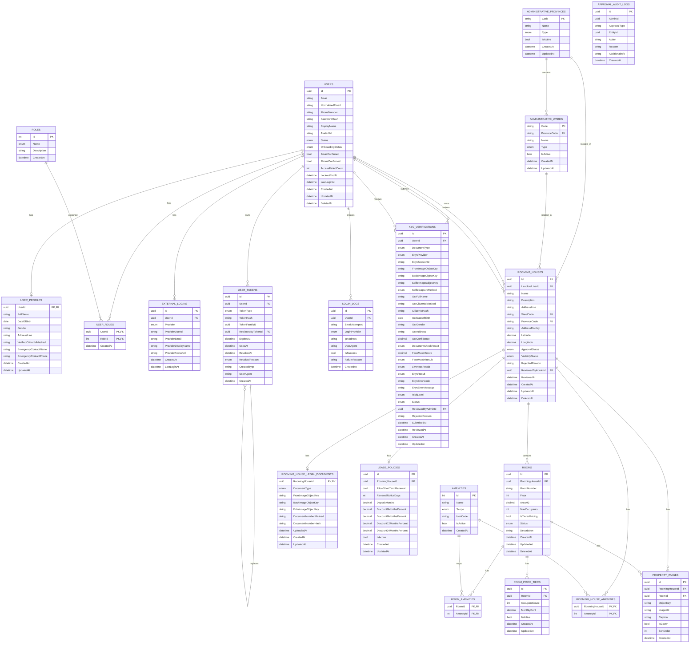
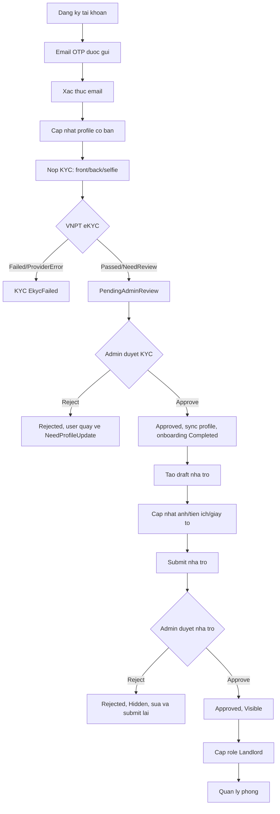
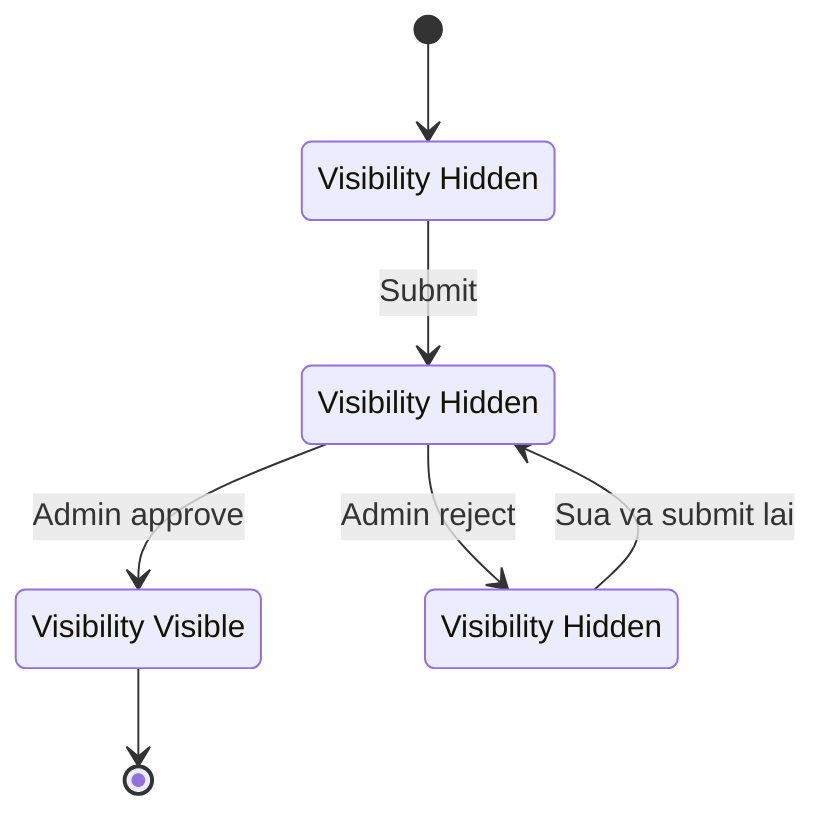
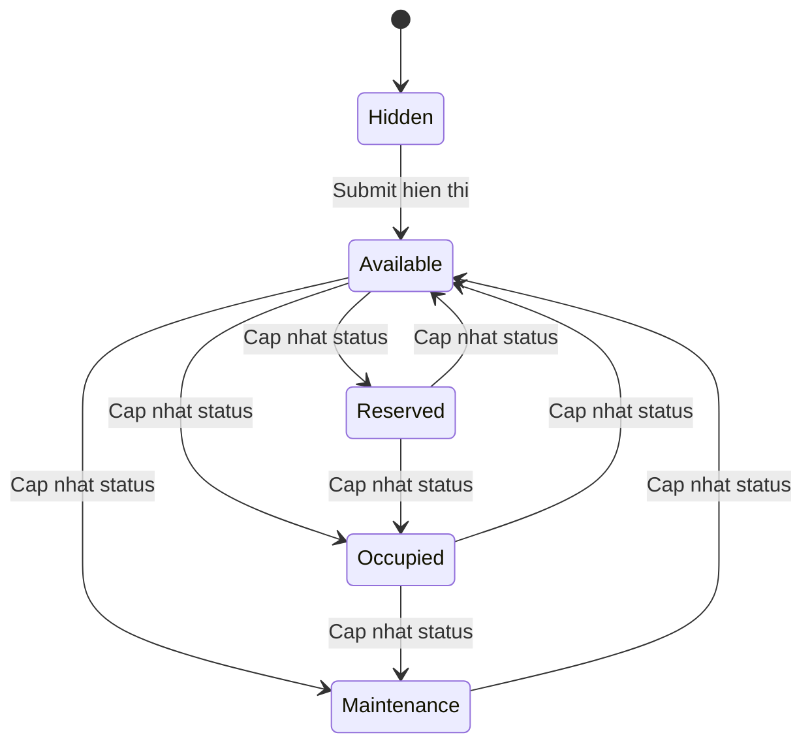

# Smart Rental Platform - Cau truc, ERD va logic nghiep vu

Ngay ra soat: 31/05/2026

## 1. Tong quan du an

Smart Rental Platform la nen tang quan ly/tim thue phong tro, gom:

- Backend: ASP.NET Core Web API, Entity Framework Core, PostgreSQL.
- Frontend: React, TypeScript, Vite.
- Kien truc backend: tach lop theo huong Clean Architecture.
- Luu tru file: local public storage cho anh public, local private storage cho anh/giay to KYC.
- Tich hop ngoai: email OTP, Google login, VNPT eKYC co mock/real client.

## 2. Cau truc thu muc chinh

```txt
smart-rental-platform/
├── client/                         # Frontend React + Vite
│   ├── src/
│   │   ├── app/                    # App shell, router, providers
│   │   ├── config/                 # Cau hinh runtime env
│   │   ├── features/               # Module UI theo nghiep vu
│   │   │   ├── admin/              # Trang admin duyet KYC/nha tro
│   │   │   ├── administrative/     # API tinh/phuong
│   │   │   ├── auth/               # Dang ky, dang nhap, OTP, quen mat khau
│   │   │   ├── files/              # Upload file
│   │   │   ├── home/               # Trang /me
│   │   │   ├── kyc/                # Nop KYC, xem trang thai KYC
│   │   │   ├── landlord/           # Dashboard chu tro, chi tiet nha tro/phong
│   │   │   ├── profile/            # Ho so ca nhan
│   │   │   ├── rooming-houses/     # Tao/cap nhat nha tro
│   │   │   └── rooms/              # API/types phong
│   │   ├── shared/                 # API client, UI component, utils
│   │   └── styles/                 # Global CSS
│   ├── package.json
│   └── vite.config.ts
├── server/
│   ├── SmartRentalPlatform.slnx
│   └── src/
│       ├── SmartRentalPlatform.Api            # Controllers, middleware, auth, Swagger
│       ├── SmartRentalPlatform.Application    # Use case/service nghiep vu
│       ├── SmartRentalPlatform.Contracts      # Request/response DTO
│       ├── SmartRentalPlatform.Domain         # Entities va enums
│       └── SmartRentalPlatform.Infrastructure # EF Core, storage, security, external services
├── docs/                                      # Ghi chu/thiet ke/plan
├── docker-compose.yml                         # PostgreSQL local
├── DATABASE_ERD.md                            # Tai lieu ERD da co san
└── PROJECT_LOGIC_AUDIT.md                     # Tai lieu audit logic da co san
```

## 3. Backend layers

### SmartRentalPlatform.Api

Chua cac controller API:

- `AuthController`: dang ky, xac thuc email OTP, dang nhap, refresh token, logout, quen/reset/doi mat khau, Google login.
- `UsersController`: thong tin user hien tai, profile, dieu kien dang ky chu tro, session dang nhap.
- `KycController`: nop KYC, trang thai KYC, lich su KYC, test document VNPT.
- `RoomingHousesController`: onboarding nha tro, tao draft, cap nhat nha tro, tien ich, anh, giay to, submit duyet, lease policy.
- `RoomsController`: tao/cap nhat phong, anh phong, tien ich phong, price tiers, trang thai phong, submit hien thi.
- `AdminKycController`: danh sach KYC cho duyet, chi tiet, approve/reject, lich su user.
- `AdminRoomingHousesController`: danh sach nha tro cho duyet/cong khai, chi tiet, approve/reject.
- `AdminUsersController`: danh sach va chi tiet user.
- `AdminMediaController`: doc private media cho admin.
- `FilesController`: upload anh.
- `AmenitiesController`, `AdministrativeController`: catalog tien ich va dia gioi hanh chinh.
- `PublicRoomingHousesController`: danh sach nha tro public.
- `HealthController`: health check.

### SmartRentalPlatform.Application

Chua service nghiep vu:

- Auth: `AuthService`, `AuthSessionService`, `AuthPasswordService`, `GoogleLoginService`.
- User/profile: `UserService`.
- KYC: `KycService`, admin approval service.
- Rooming house: query, draft, media, legal document, lease policy, submit.
- Room: query, command, media, price tier, status.
- Admin approval/audit: KYC, nha tro, user listing, audit log.
- Catalog: administrative, amenities.

### SmartRentalPlatform.Domain

Chua entity va enum cot loi:

- Users: `User`, `Role`, `UserRole`, `UserProfile`, `ExternalLogin`, `UserToken`, `LoginLog`, `KycVerification`.
- Properties: `RoomingHouse`, `Room`, `RoomPriceTier`, `Amenity`, `RoomingHouseAmenity`, `RoomAmenity`, `PropertyImage`, `RoomingHouseLegalDocument`, `LeasePolicy`.
- Administrative: `AdministrativeProvince`, `AdministrativeWard`.
- AdminApproval: `ApprovalAuditLog`.

### SmartRentalPlatform.Infrastructure

Chua:

- `AppDbContext` va EF Core configurations/migrations.
- Seed roles, amenities, dia gioi hanh chinh, admin development.
- JWT/password/hash services.
- Local file/private storage.
- Email sender.
- Google auth service.
- VNPT eKYC mock/real client.

## 4. Frontend da co

Routes hien co:

- `/auth/login`: dang nhap.
- `/auth/register`: dang ky.
- `/auth/verify-email`: xac thuc OTP email.
- `/auth/forgot-password`: quen mat khau.
- `/auth/reset-password`: dat lai mat khau.
- `/me`: trang ca nhan/co ban.
- `/me/profile`: cap nhat profile, avatar, session/security.
- `/me/kyc`: nop KYC.
- `/me/kyc-status`: xem trang thai KYC.
- `/landlord/register`: tao ho so nha tro.
- `/landlord/dashboard`: dashboard chu tro.
- `/landlord/rooming-houses/:id`: chi tiet nha tro/phong.
- `/admin`: trang admin duyet KYC/nha tro, duoc bao ve bang role Admin.

Frontend da co cac guard:

- `ProtectedRoute`: yeu cau dang nhap.
- `OnboardingGuard`: dieu huong theo onboarding/profile/KYC.
- `RoleGuard`: chan route theo role.

## 5. ERD tong quan



## 6. Trang thai enum nghiep vu chinh

### User/role/onboarding

- `RoleName`: `Admin`, `Tenant`, `Landlord`.
- `OnboardingStatus`: `NeedProfileUpdate`, `KycPending`, `Completed`.
- `UserStatus`: co xu ly `Active`, `Banned`, `Deleted` trong login.

### KYC

- `KycVerificationStatus`: `Pending`, `PendingEkyc`, `EkycFailed`, `PendingAdminReview`, `Approved`, `Rejected`, `Cancelled`.
- `EkycResult`: `Passed`, `Failed`, `NeedReview`, `ProviderError`.
- `KycRiskLevel`: `Low`, `Medium`, `High`.

### Nha tro/phong

- `RoomingHouseApprovalStatus`: `Draft`, `Pending`, `Approved`, `Rejected`.
- `RoomingHouseVisibilityStatus`: `Hidden`, `Visible`.
- `RoomStatus`: `Available`, `Reserved`, `Occupied`, `Maintenance`, `Hidden`.

## 7. Logic nghiep vu da lam duoc

### 7.1 Xac thuc va quan ly phien

Da co cac luong:

- Dang ky tai khoan local bang email/password.
- Mac dinh gan role `Tenant` khi dang ky.
- Tao OTP xac thuc email, hash OTP vao `UserTokens`.
- Xac thuc email OTP, danh dau token da dung/thu hoi.
- Gui lai OTP, chan spam gui lai trong 60 giay, revoke token cu.
- Dang nhap local:
  - Kiem tra email/password.
  - Chan user `Banned`, `Deleted`.
  - Lock tai khoan 15 phut sau 5 lan sai mat khau.
  - Yeu cau email confirmed moi cho dang nhap.
  - Ghi `LoginLogs`.
  - Cap access token + refresh token.
- Refresh token rotation:
  - Moi lan refresh tao refresh token moi.
  - Token cu duoc danh dau used/revoked.
  - Neu phat hien reuse refresh token thi revoke ca token family.
- Logout 1 phien va logout tat ca thiet bi.
- Danh sach active sessions va revoke session theo user.
- Quen mat khau, verify reset OTP, reset password, change password.
- Google login thong qua `GoogleLoginService` va `ExternalLogin`.

### 7.2 Ho so nguoi dung va onboarding

Da co:

- API lay user hien tai kem roles, avatar, onboarding status.
- API lay/cap nhat profile ca nhan.
- Profile cho phep cap nhat display name, phone, avatar, emergency contact.
- Thong tin dinh danh chinh nhu full name, DOB, gender, address, citizen id masked duoc sync tu KYC approved.
- Kiem tra dieu kien dang ky chu tro:
  - Email phai confirmed.
  - Profile/dinh danh phai duoc KYC approved.
  - Neu KYC dang cho duyet thi dieu huong sang trang status.
  - Neu chua nop KYC thi dieu huong sang trang nop KYC.
  - Neu da la Landlord thi dieu huong dashboard.
  - Neu dang co nha tro pending thi khong cho tao ho so moi.

### 7.3 KYC/eKYC

Da co:

- Nop KYC voi anh mat truoc, mat sau va selfie.
- Validate bat buoc du 3 file.
- Luu file KYC vao private storage.
- Goi VNPT eKYC qua interface `IVnptEkycClient`, co mock client va real client.
- Parse OCR/result:
  - Ho ten, CCCD masked, DOB, gender, address.
  - Document check, face match, liveness, confidence.
- Hash CCCD bang SHA-256 de kiem tra trung lap ma khong luu raw citizen id.
- Chan CCCD da gan voi account approved khac.
- Tinh risk level:
  - Failed/provider error/tampered/liveness failed/face not match -> High.
  - Need review, document check khong valid, confidence/face score < 0.85 -> Medium.
  - Con lai -> Low.
- Ket qua provider fail/failed -> `EkycFailed`.
- Ket qua hop le -> `PendingAdminReview`.
- Cap nhat user `OnboardingStatus = KycPending` khi cho admin duyet.
- User xem duoc latest KYC status va lich su KYC.
- Admin xem danh sach KYC cho duyet, chi tiet KYC kem private media URL.
- Admin approve KYC:
  - Chuyen KYC sang `Approved`.
  - Sync OCR vao `UserProfile`.
  - Cap nhat `OnboardingStatus = Completed`.
- Admin reject KYC:
  - Chuyen KYC sang `Rejected`, luu ly do.
  - Dua user ve `NeedProfileUpdate`.
- Admin xem lich su KYC theo user.

### 7.4 Dang ky va duyet nha tro/chu tro

Da co:

- Tao draft nha tro cho user.
- Chan tao draft moi neu user dang co nha tro `Draft`, `Pending` hoac `Rejected` chua xu ly.
- Validate thong tin co ban:
  - Ten nha tro bat buoc.
  - Dia chi bat buoc.
  - Province/Ward bat buoc va phai ton tai trong bang administrative active.
  - Latitude trong [-90, 90], longitude trong [-180, 180].
- Tu build `AddressDisplay` tu address line + ten phuong + ten tinh.
- Cap nhat draft/nha tro, khong cho cap nhat khi dang `Pending`.
- Cap nhat tien ich nha tro:
  - Chi chap nhan amenity active co scope `House` hoac `Both`.
  - Replace toan bo mapping cu bang danh sach moi.
- Cap nhat anh nha tro:
  - It nhat 3 anh.
  - Dung 1 anh cover.
  - Object key bat buoc.
  - Kiem tra image id thuoc dung nha tro.
  - Them/cap nhat/xoa anh theo request.
- Cap nhat giay to phap ly:
  - Chi cho cap nhat khi nha tro `Draft` hoac `Rejected`.
  - Bat buoc document type hop le, anh truoc, anh sau, so giay to.
  - Mask va hash so giay to.
- Submit nha tro cho admin duyet:
  - Chi `Draft` hoac `Rejected` moi submit duoc.
  - Validate full thong tin, dia chi, anh, legal document.
  - Chuyen sang `Pending`, `Hidden`, reset reject/reviewer.
- Admin duyet nha tro:
  - Chi duyet nha tro `Pending`.
  - Approve -> `ApprovalStatus = Approved`, `VisibilityStatus = Visible`.
  - Cap role `Landlord` cho user sau khi nha tro approved va KYC da approved.
  - Thuc hien trong transaction.
- Admin reject nha tro:
  - Chi reject nha tro `Pending`.
  - Chuyen `Rejected`, `Hidden`, luu ly do/reviewer.
- Admin xem danh sach pending/public va chi tiet nha tro kem landlord, legal document, images, amenities, rooms.
- Public API lay danh sach nha tro approved/visible.

### 7.5 Quan ly phong

Da co:

- Tao phong trong nha tro cua landlord.
- Yeu cau nha tro da approved moi duoc thao tac phong.
- Validate phong:
  - So phong bat buoc.
  - Tang >= 0.
  - Dien tich > 0 neu co.
  - Max occupants > 0.
  - So phong khong trung trong cung nha tro.
- Cap nhat phong.
- Cap nhat tien ich phong:
  - Chi chap nhan amenity active co scope `Room` hoac `Both`.
- Cap nhat anh phong:
  - It nhat 3 anh.
  - Dung 1 anh cover.
  - Object key bat buoc.
  - Kiem tra anh thuoc dung phong.
- Cap nhat bang gia phong:
  - Bat buoc co it nhat 1 price tier.
  - Neu `IsTieredPricing = true`: phai co du price tier cho tung so nguoi tu 1 den `MaxOccupants`.
  - Neu gia co dinh: chi duoc 1 tier va `OccupantCount = 1`.
  - `MonthlyRent > 0`.
- Submit phong hien thi:
  - Chi phong `Hidden` moi submit duoc.
  - Validate full thong tin, anh, price tiers.
  - Chuyen sang `Available`.
- Cap nhat trang thai van hanh phong:
  - Khong cho doi trang thai neu phong dang `Hidden`.
  - Khong cho chuyen ve `Hidden` qua API status.
  - Cho cac trang thai van hanh: `Available`, `Reserved`, `Occupied`, `Maintenance`.

### 7.6 Chinh sach thue

Da co entity va service `RoomingHouseLeasePolicyService`:

- Lay/cap nhat policy theo nha tro.
- Truong policy gom:
  - Cho phep gia han ngan han.
  - So ngay bao truoc khi gia han.
  - So thang dat coc.
  - Giam gia hop dong 6/9/12/24 thang.
  - Trang thai active.

### 7.7 Catalog va dia gioi hanh chinh

Da co:

- Seed roles.
- Seed amenities.
- Seed administrative provinces/wards tu CSV.
- API lay danh sach tinh/thanh active.
- API lay ward theo province.
- API lay amenity active.

### 7.8 Upload va media

Da co:

- Public image upload endpoint.
- Anh nha tro/phong luu `ObjectKey` va public `ImageUrl` dang `/uploads/{objectKey}`.
- KYC/private legal media luu private object key.
- Admin co endpoint doc private media theo `objectKey`.

### 7.9 Admin

Da co:

- Admin xem user list/detail.
- Admin xem/duyet/tuchoi KYC.
- Admin xem/duyet/tuchoi nha tro.
- Co entity `ApprovalAuditLog` va service ghi audit, dung de luu admin/action/entity/reason/additional info.
- Frontend admin page da co route `/admin`, bi chan boi role `Admin`.

## 8. Luong nghiep vu chinh

### 8.1 Tu user moi den chu tro



### 8.2 Vong doi nha tro



### 8.3 Vong doi phong



## 9. Nhan xet pham vi hien tai

Da hoan thanh kha day du cac phan nen tang:

- Authentication/session/token/OTP.
- Profile va onboarding.
- KYC co provider abstraction, private media, admin review.
- Dang ky, cap nhat, submit va admin duyet nha tro.
- Quan ly phong, anh, tien ich, bang gia, trang thai.
- Catalog dia gioi hanh chinh/tien ich.
- Frontend cho auth, profile, KYC, landlord dashboard/detail, admin review.

Chua thay trong code hien tai cac module nghiep vu sau:

- Dat phong/booking cua tenant.
- Hop dong thue.
- Thanh toan/coc/hoa don.
- Chat/yeu cau lien he.
- Tim kiem/filter public nang cao tren frontend.
- Review/rating.
- Notification realtime.
- Bao cao doanh thu/analytics.

